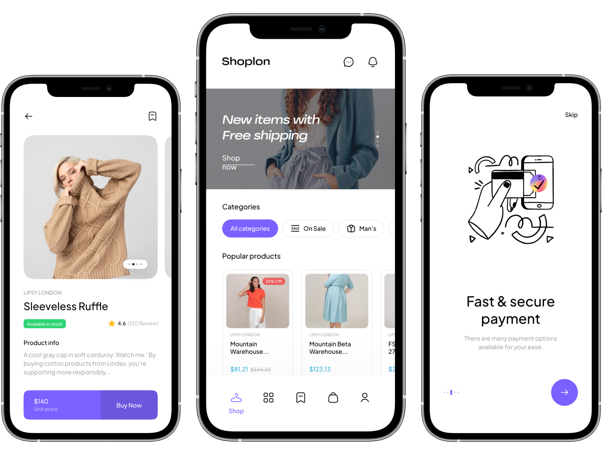

# Flutter E-Commerce Application
 
 
<h3>Template of Ecommerce Application</h3>

 

 

### Onboarding

- Onboarding Choose item
- Onboarding Add to cart
- Onboarding Pay online
- Onboarding Track order
- Onboarding Find store
- Notification permission
- Select language

### Authentication

- Log in
- Forgot password
  - Choose verification method
  - Verification code
- Set new password
- Done reset password
- Sign up
  - Setup profile
  - Verification code
- Successfully sign up
- Terms and conditions
- Enable fingerprint
- Enable face ID

### Product

- Product page
  - Notify when available (Out of stock)
  - Buy Now
  - Product details
  - Product reviews
  - Add review
  - Shipping methods
  - Product return policy
  - Product size guide
  - Store Pickup Availability
  - Added to cart message
  - Product gallery (Will be added soon)

### Main Page

- Home page
- On sales page
- Kids product page
- Brand page
- Discover Page (Categories)
  - Style 1
  - Style 2 (Will be added soon)
  - Style 3 (Will be added soon)
- Bookmark products page

### Search

- Recent search (Search history)
- Search suggestions
- Search filters
  - Size filter
  - Color filter
  - Brand filter
  - Price filter
  - Sort by
- Search results
  - Product not found

### Cart

- Products on Cart
- Empty cart
- Choose address
- Review & payment
- Checkout / Payment method
  - Select card
  - Pay with cash
  - Use credit
- Thanks for order
- Add new card
- Scan card (Will be added soon)

### Profile

- Account
  - Normal version
  - Pro version
  - Profile
    - Edit profile
  - Notifications
    - Empty notification
    - Enable notification
    - Notification options
  - Select Language
  - Addresses
    - Empty address
    - Add new address
  - Add number
    - Verification code
  - Selected location
  - Payment
    - Cards
    - Empty payment
  - Wallet
    - Empty Wallet
    - Wallet history
  - Help & Chat (Support)
    - Chat
  - Preferences

### Order

- Account Orders
  - Processing orders
    - Cancel order
  - Canceled orders
  - Delivered orders
  - Return orders (Will be added soon)
  - More screens added in that sector soon

### Return & Request (Will be added soon)

- Return order list
- Empty return order
- Return order
- Return detail

### Error & Permission

- Notification permission
- No notification
- Select language
- No internet
- Server error
- Location permissions
- No search result
- Empty order list
- No Address found
- Empty payment
- Empty wallet

and MORE!!!! 🤩

<!-- All Screens Used :

NotificationPermissionScreen()
PreferredLanguageScreen()
SelectLanguageScreen()
SignUpVerificationScreen()
ProfileSetupScreen()
VerificationMethodScreen()
OtpScreen()
SetNewPasswordScreen()
DoneResetPasswordScreen()
TermsOfServicesScreen()
SetupFingerprintScreen()
SetupFingerprintScreen()
SetupFingerprintScreen()
SetupFingerprintScreen()
SetupFaceIdScreen()
OnSaleScreen()
BannerLStyle2()
BannerLStyle3()
BannerLStyle4()
SearchScreen()
SearchHistoryScreen()
NotificationsScreen()
EnableNotificationScreen()
NoNotificationScreen()
NotificationOptionsScreen()
ProductInfoScreen()
ShippingMethodsScreen()
ProductReviewsScreen()
SizeGuideScreen()
BrandScreen()
CartScreen()
EmptyCartScreen()
PaymentMethodScreen()
ThanksForOrderScreen()
CurrentPasswordScreen()
EditUserInfoScreen()
OrdersScreen()
OrderProcessingScreen()
OrderDetailsScreen()
CancleOrderScreen()
DelivereOrdersdScreen()
AddressesScreen()
NoAddressScreen()
AddNewAddressScreen()
ServerErrorScreen()
NoInternetScreen()
ChatScreen()
DiscoverWithImageScreen()
SubDiscoverScreen()
AddNewCardScreen()
EmptyPaymentScreen()
GetHelpScreen -->
